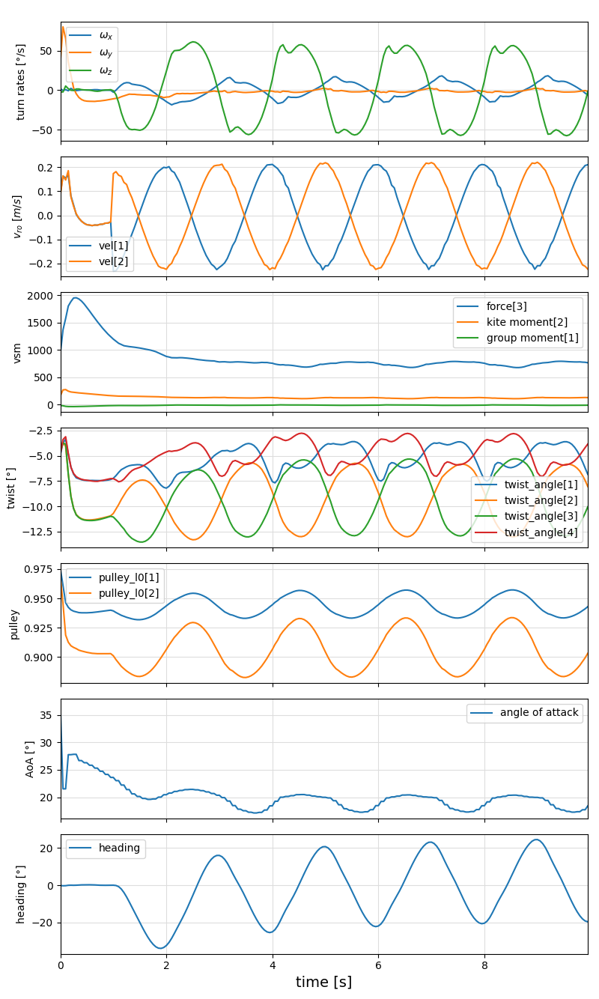
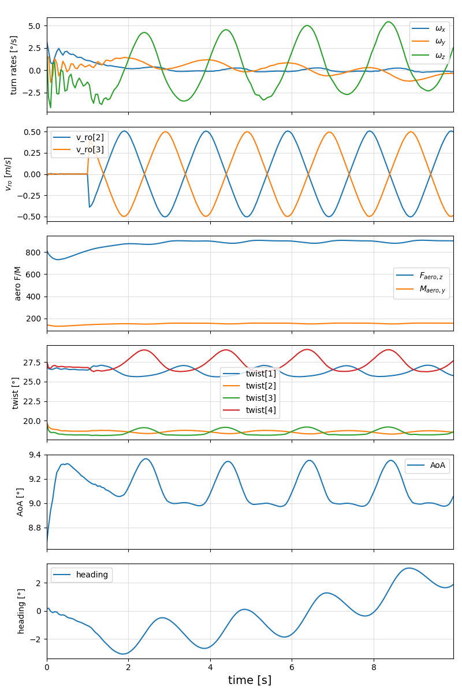

```@meta
CurrentModule = KiteModels
```

# SymbolicAWEModel Examples Moved

The examples for using the RAM air kite model (`SymbolicAWEModel`) have been moved to a separate package.

## Documentation Now Available At

Please refer to the [SymbolicAWEModels.jl](https://github.com/OpenSourceAWE/SymbolicAWEModels.jl) package for:

- RAM air kite examples
- `SymbolicAWEModel` usage tutorials
- Example projects and scripts
- Performance benchmarks

The `SymbolicAWEModel` and all related examples have been moved to this dedicated package for better maintainability and focused development.

[ Info: Creating wing, aero, vsm_solver, sys_struct and s:
Time elapsed: 15.387790726 s
[ Info: Initialized integrator in 29.545349428 seconds
[ Info: System initialized at:
Time elapsed: 57.134361795 s
[ Info: Total time without plotting:
Time elapsed: 75.475794933 s
┌ Info: Performance:
│   times_realtime = 5.038873691119553
└   integrator_times_realtime = 16.40954043592023
```
You can save another 45s when checking out the code with git, create a system image and run the example from the checked out repository.

In this example, the kite is first parked, and then a sinus-shaped steering input is applied such that is dancing
in the sky.



## Running the second example
```julia
SIMPLE=true; include("examples/ram_air_kite.jl")
```
The simple model has a very simple bridle system without pulleys and with less attachment points on the wing. 
While the default model has a [speed system](https://kiteboarding.com/proddetail.asp?prod=ozone-r1v4-pro-tune-speedsystem-complete) with pulleys and more attachment points on the wing.



## Linearization
The following example creates a nonlinear system model, finds a steady-state operating point, linearizes the model 
around this operating point and compares the simulation results of the non-linear and linearized system:
```julia
include("examples/lin_ram_model.jl")
```
See: [`lin_ram_model.jl`](https://github.com/ufechner7/KiteModels.jl/blob/main/examples/lin_ram_model.jl)

## How to create a SymbolicAWEModel
The following code is a minimal example that shows how to create a ram air kite struct:
```julia
using KiteModels

# Initialize model
set = load_settings("system_ram.yaml")

sam = SymbolicAWEModel(set)
```