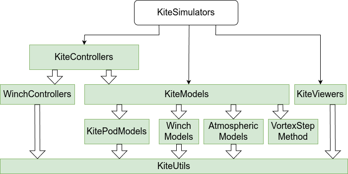

```@meta
CurrentModule = KiteModels
```

# KiteModels

Documentation for the package [KiteModels](https://github.com/ufechner7/KiteModels.jl).

The models have the following subcomponents, implemented in separate packages:

- AtmosphericModel from [AtmosphericModels](https://github.com/aenarete/AtmosphericModels.jl)
- WinchModel from [WinchModels](https://github.com/aenarete/WinchModels.jl)
- KitePodModel from  [KitePodModels](https://github.com/aenarete/KitePodModels.jl)
- The aerodynamic forces and moments of some of the models are calculated using the package [VortexStepMethod](https://github.com/Albatross-Kite-Transport/VortexStepMethod.jl)

This package is part of Julia Kite Power Tools, which consist of the following packages:



## What to install

If you want to run simulations and see the results in 3D, please install the meta package  [KiteSimulators](https://github.com/aenarete/KiteSimulators.jl) which contains all other packages. If you are not interested in 3D visualization or control you can just install this package. When you have installed the package KiteSimulators, use the command `using KiteSimulators` instead of `using KiteModels` when this is mentioned in the documentation.

## Installation as package

Install [Julia 1.11](https://ufechner7.github.io/2024/08/09/installing-julia-with-juliaup.html), if you haven't already. Julia 1.10 and 1.12 are also supported, but the performance is worse. On Linux, make sure that Python3 and Matplotlib are installed:

```bash
sudo apt install python3-matplotlib
```

Make sure that `ControlPlots.jl` works as explained in the [installation instructions](https://github.com/aenarete/ControlPlots.jl?tab=readme-ov-file#installation).

Before installing this software it is suggested to create a new project, for example like this:

```bash
mkdir test
cd test
julia --project="."
```

Then add KiteModels from  Julia's package manager, by typing:

```julia
using Pkg
pkg"add KiteModels"
```

at the Julia prompt. You can run the unit tests with the command (careful, can take 60 min):

```julia
pkg"test KiteModels"
```

You can copy the examples to your project with:

```julia
using KiteModels
KiteModels.install_examples()
```

This also adds the extra packages, needed for the examples to the project. Furthermore, it creates a folder `data`
with some example input files. You can now run the examples with the command:

```julia
include("examples/menu.jl")
```

This might take two minutes. To speed up the model initialization, you can create a system image:

```bash
cd bin
./create_sys_image
```

If you now launch Julia with `./bin/run_julia` and then run the above example again, it should be about three
times faster.

## Installation from git

Install [Julia 1.11](https://ufechner7.github.io/2024/08/09/installing-julia-with-juliaup.html), if you haven't already. Julia 1.10 and 1.12 are also supported, but the performance is worse. On Linux, make sure that Python3 and Matplotlib are installed:

```bash
sudo apt install python3-matplotlib
```

Make sure that `ControlPlots.jl` works as explained in the [installation instructions](https://github.com/aenarete/ControlPlots.jl?tab=readme-ov-file#installation).

Before installing this software it is suggested to create a new folder, for example like this:

```bash
mkdir awe
cd awe
```

Then add KiteModels from git:

```bash
git clone https://github.com/OpenSourceAWE/KiteModels.jl.git
cd KiteModels.jl
```

Then, run the install script:

```bash
cd bin
./install
cd ..
```

You can now launch Julia:

```bash
./bin/run_julia
```

and run one of the two example menus:

```julia
menu() # or menu2()
```

To reduce the start time, you can create a system image:

```bash
cd bin
./create_sys_image
```

If you now launch Julia with `./bin/run_julia` and then run the above example again, it should be about twice as fast.

## News

### February 2026

- the `SymbolicAWEModel` has been moved to a separate package [SymbolicAWEModels.jl](https://github.com/OpenSourceAWE/SymbolicAWEModels.jl) for better maintainability

### November 2024

- the four point kite model KPS4 was extended to include aerodynamic damping of pitch oscillations;
  for this purpose, the parameters `cmq` and `cord_length` must be defined in `settings.yaml`
- the four point kite model KPS4 was extended to include the impact of the deformation of the
  kite on the turn rate; for this, the parameter `smc` must be defined in `settings.yaml`

### October 2024

- the orientation is now represented with respect to the NED reference frame
- azimuth is now calculated in wind reference frame. This allows it to handle changes of the wind direction
  during flight correctly.
- many unit tests added by a new contributor
- many tests for model verification added; they can be accessed using the `menu2.jl` script
- the documentation was improved

## Provides

The types [`KPS3`](@ref) and [`KPS4`](@ref), representing the one point and four point kite models, together with the high level simulation interface consisting of the functions [`init!`](@ref) and [`next_step!`](@ref). Other kite models can be added inside or outside of this package by implementing the non-generic methods required for an AbstractKiteModel.

Additional functions to provide inputs and outputs of the model on each time step. In particular the constructor [`SysState`](@ref) can be called once per time step to create a SysState struct for
logging or for displaying the state in a viewer. For the KPS3 and KPS4 model, once per time step the [`residual!`](@ref) function is called as many times as needed to find the solution at the end
of the time step. The formulas are based on basic physics and aerodynamics and can be quite simple because a differential algebraic notation is used.

## One point model

This model assumes the kite to be a point mass. This is sufficient to model the aerodynamic forces, but the dynamic concerning the turning action of the kite is not realistic.
When combined with a controller for the turn rate it can be used to simulate a pumping kite power system with medium accuracy.

## Four point model

This model assumes the kite to consist of four-point masses with aerodynamic forces acting on points B, C and D. It reacts much more realistically than the one-point model because it has rotational inertia in every axis.


## Tether

The tether is modeled as point masses, connected by spring-damper elements. Aerodynamic drag is modeled realistically. When reeling out or in the unstreched length of the spring-damper elements
is varied. This does not translate into physics directly, but it avoids adding point masses at run-time, which would be even worse because it would introduce discontinuities. When using
Dyneema or similar high-strength materials for the tether the resulting system is very stiff which is a challenge for the solver.

## Reference frames and control inputs

- a positive `set_torque` will accelerate the reel-out, a negative `set_torque` counteract the pulling force of the kite. The unit is [N/m] as seen at the motor/generator axis.
- the `depower` settings are dimensionless and can be between zero and one. A value equal to $\mathrm{depower\_zero}/100$ from the `settings.yaml` file means that the kite is fully powered.
- the `heading` angle, the direction the nose of the kite is pointing to is positive in clockwise direction when seen from above.
- the `steering` input, dimensionless and in the range of -1.0 .. 1.0. A positive steering input causes a positive turn rate (derivative of the heading).

A definition of the reference frames can be found in the [reference frames documentation](https://OpenSourceAWE.github.io/KiteUtils.jl/dev/reference_frames/).

## Further reading

The one point and four point kite models are described in detail in [Dynamic Model of a Pumping Kite Power System](http://arxiv.org/abs/1406.6218).

## See also

- [Research Fechner](https://research.tudelft.nl/en/publications/?search=Fechner+wind&pageSize=50&ordering=rating&descending=true) for the scientific background of this code
- The meta-package  [KiteSimulators](https://github.com/aenarete/KiteSimulators.jl)
- the package [KiteUtils](https://github.com/OpenSourceAWE/KiteUtils.jl)
- the packages [WinchModels](https://github.com/aenarete/WinchModels.jl) and [KitePodModels](https://github.com/aenarete/KitePodModels.jl) and [AtmosphericModels](https://github.com/OpenSourceAWE/AtmosphericModels.jl)
- the packages [WinchControllers](https://github.com/OpenSourceAWE/WinchControllers.jl), [KiteControllers](https://github.com/aenarete/KiteControllers.jl) and [KiteViewers](https://github.com/OpenSourceAWE/KiteViewers.jl)
- the [VortexStepMethod](https://github.com/OpenSourceAWE/VortexStepMethod.jl)

Authors: Uwe Fechner (<uwe.fechner.msc@gmail.com>), Bart van de Lint (<bart@vandelint.net>)
