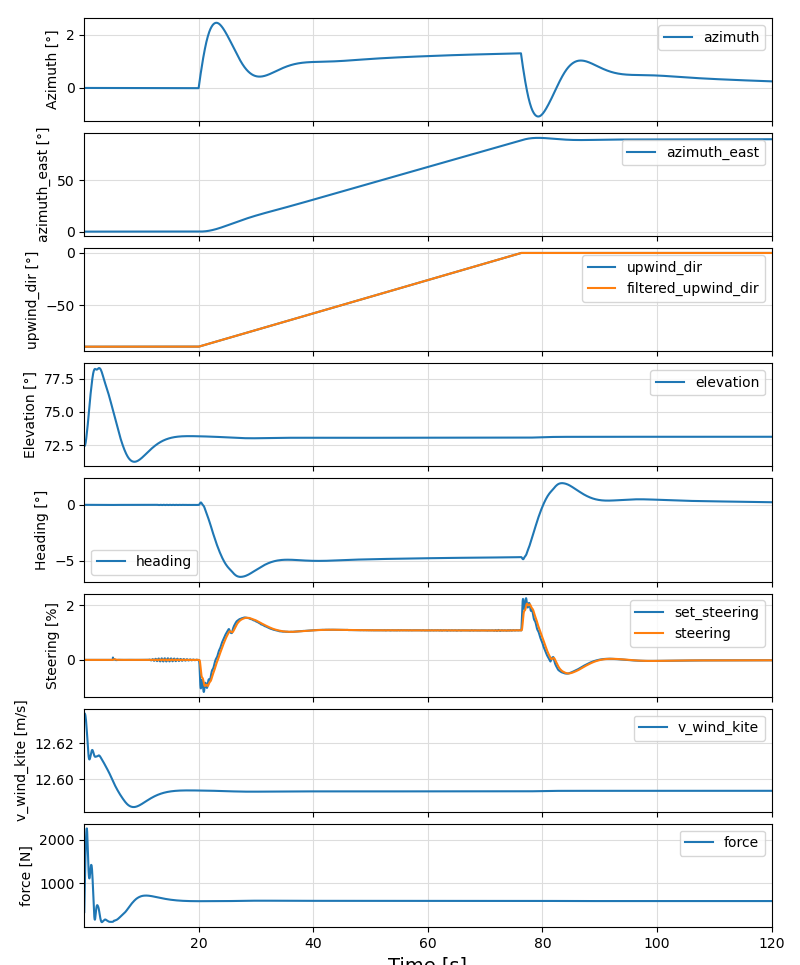
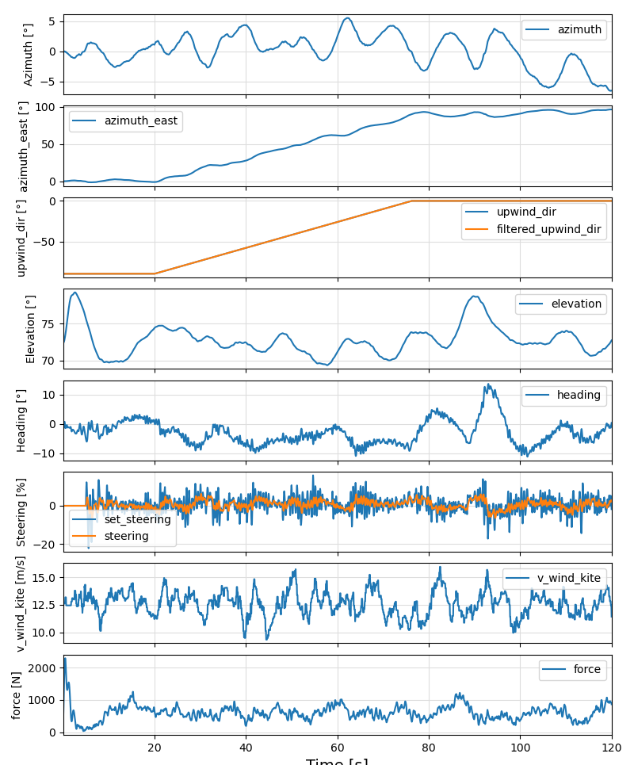

# Turbulence

## The file `gui.yaml`

Example:

```yaml
gui:
    project: hydra20_600.yml             # the selected project
    default_turbulence: 1.0              # default turbulence level for simulations, between 0.0 and 1.0
```

The file `gui.yaml` stores the default turbulence. It can be changed using a menu entry.
The project entry is not used for the examples of this package.

## The second menu
To show the second menu, type `menu2()`. You should see:

```text
Choose function to execute or `q` to quit: 
 > set_default_turbulence()
   plot_cl_cd_plate = include("plot_cl_cd_plate.jl")
   plot_side_cl = include("plot_side_cl.jl")
   steering_test_4p = include("steering_test_4p.jl")
   plot_parking_test = include("plot_parking_test.jl")
   calculate_rot_inertia = include("calculate_rotational_inertia.jl")
   show_kite = include("../examples_3d/show_kite.jl")
   parking_4p = include("../examples_3d/parking_4p.jl")
   auto_parking_4p = include("../examples_3d/auto_parking_4p.jl")
   parking_wind_dir = include("../examples_3d/parking_wind_dir.jl")
   build_docu = include("../scripts/build_docu.jl")
 > quit
```

The first menu entry can be used to set the default turbulence.

## Turbulence

The relative turbulence (`use_turbulence`) can be specified at two locations:

1. as `default_turbulence` in the file `gui.yaml`
2. in one of the `settings_*.yaml` files in the section `environment`

The first entry has the highest priority.

The value from the `settings_*.yaml` files is mainly used for the examples of the first menu.

For further details on the mathematical model, used to create the turbulent wind field,
look at [AtmosphericModels.jl](https://opensourceawe.github.io/AtmosphericModels.jl/dev/).

The example "parking\_wind\_dir.jl" produces the following output:

### Without turbulence



### With turbulence (8.9% turbulence intensity)



The turbulence intensity at the height of the kite is calculated and printed when running the example.
