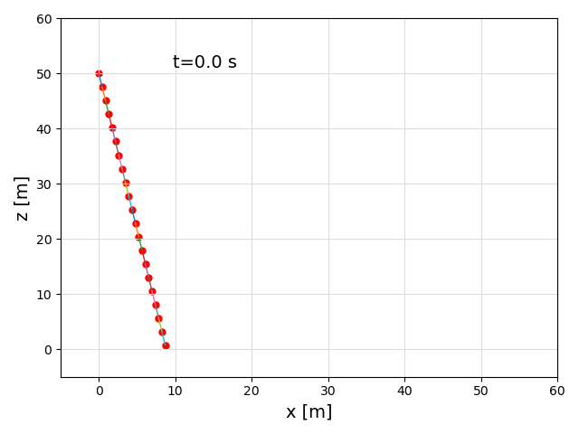

```@meta
CurrentModule = KiteModels
```
# Custom SystemStructure and SymbolicAWESystem

A custom `SystemStructure` can be used to create models of kite power systems of almost any configuration.
- custom amount of tethers
- custom bridle configurations
- quasi-static or dynamic point masses
- different amounts of stiffness, damping and diameter on different tether segments

## Creating a simple tether

We start by loading the necessary packages and defining settings and parameters.

```julia
using KiteModels, VortexStepMethod, ControlPlots

set = se("system_ram.yaml")
set.segments = 20
dynamics_type = DYNAMIC
```

Then, we define vectors of the system structure types we are going to use. For this simple example we only need points and segments.

```julia
points = Point[]
segments = Segment[]

points = push!(points, Point(1, zeros(3), STATIC; wing_idx=0))
```

The first point we add is a static point. There are four different [`DynamicsType`](@ref)s to choose from: `STATIC`, `QUASI_STATIC`, `DYNAMIC` and `WING`. `STATIC` just means that the point doesn't move. `DYNAMIC` is a point modeled with acceleration, while `QUASI_STATIC` constrains this acceleration to be zero at all times. A `WING` point is connected to a rigid wing body.

Now we can add `DYNAMIC` points and connect them to each other with segments. `BRIDLE` segments don't need to have a tether, because they have a constant unstretched length.
```julia
segment_idxs = Int[]
for i in 1:set.segments
    global points, segments
    point_idx = i+1
    pos = [0.0, 0.0, i * set.l_tether / set.segments]
    push!(points, Point(point_idx, pos, dynamics_type; wing_idx=0))
    segment_idx = i
    push!(segments, Segment(segment_idx, (point_idx-1, point_idx), BRIDLE))
    push!(segment_idxs, segment_idx)
end
```

In order to describe the initial orientation of the structure, we define a [`Transform`](@ref) with an elevation (-80 degrees), azimuth and heading, and a base position `[0.0, 0.0, 50.0]`.
```julia
transforms = [Transform(1, deg2rad(-80), 0.0, 0.0, [0.0, 0.0, 50.0], points[1].idx; 
                            rot_point_idx=points[end].idx)]
```

From the points, segments and transform we create a [`SystemStructure`](@ref), which can be plotted in 2d to quickly investigate if the model is correct.
```julia
sys_struct = SystemStructure("tether", set; points, segments, transforms)
plot(sys_struct, 0.0)
```


If the system looks good, we can easily model it, by first creating a [`SymbolicAWEModel`](@ref), initializing it and stepping through time.
```julia
sam = SymbolicAWEModel(set, sys_struct)

init_sim!(sam; remake=false)
for i in 1:80
    plot(sam, i/set.sample_freq)
    next_step!(sam)
end
```

